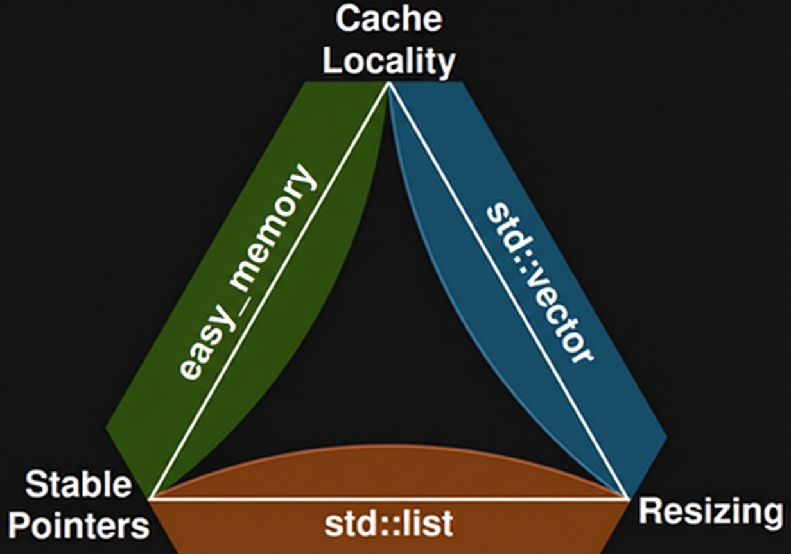

<table>
  <tr>
    <td width="150" valign="middle">
      
    </td>
    <td valign="middle">
      <div id="user-content-toc">
        <ul style="list-style: none; padding: 0; margin: 0;">
          <summary>
            <h1 style="margin: 0;">Header-Only Memory Management System</h1>
            <h3>Complex inside. Simple outside.</h3>
          </summary>
        </ul>
      </div>
      <p style="margin-top: 10px; margin-bottom: 0;">
        <a href="https://opensource.org/licenses/MIT"></a>
        <a href="https://en.wikipedia.org/wiki/C11_(C_standard_revision)"></a>
        <a href="https://www.codefactor.io/repository/github/easymem/easy_memory"></a>
        <a href="https://codecov.io/gh/easymem/easy_memory"></a>
        <a href="https://github.com/easymem/easy_memory/actions/workflows/ci.yml"></a>
      </p>
    </td>
  </tr>
</table>

<br/>

**A strictly typed, platform-agnostic, and safe memory management system designed for high-performance and embedded applications.**

## TL;DR

**What is it?** A portable memory management system that replaces standard `malloc`/`free` with advanced capabilities like arbitrary alignment, scoped lifecycles, and fragmentation-resistant strategies.

**Why use it?** To get deterministic, safe, and efficient memory control on any architecture—from x86 servers to bare-metal microcontrollers (ARM, Xtensa, etc.)—without the overhead of an OS.

**How to use it?** `#define EASY_MEMORY_IMPLEMENTATION` in one `.c` file, then just `#include "easy_memory.h"`.

## Key Features

*   **Adaptive Performance:** Optimized for real-world usage patterns. Sequential allocations and LIFO deallocations (stack-like behavior) are detected and handled in **O(1)** time via the tail block. Complex, mixed-order patterns gracefully fallback to the efficient **O(log n)** tree search.
*   **Triple-Key LLRB Tree:** Free blocks are sorted by **Size**, **Alignment Quality** (CTZ), and **Address**. This reduces fragmentation by prioritizing blocks that *naturally* satisfy alignment requirements before splitting new memory.
*   **Flexible Alignment:** Supports per-allocation alignment requests (powers of two, up to **512 bytes**). Ideal for SIMD vectors and cache-line aligned buffers.
*   **Low Overhead:** Metadata consumes only **4 machine words** per block (16 bytes on 32-bit, 32 bytes on 64-bit).
*   **Bit-Packed Efficiency:** Alignment exponents are packed into the size field, and flags utilize pointer tagging. This results in minimal metadata overhead per block.
*   **Modular Sub-Allocators:** Designed as a foundation for specialized allocators. All sub-allocators have **zero-overhead creation** (cost equivalent to a single standard allocation).
    *   **Bump:** O(1) linear allocator (Available).
    *   *Stack / Slab:* (Coming soon).
*   **Scoped Memory:** Supports `em_create_nested` for hierarchical memory management. Freeing a parent scope instantly invalidates all children with O(1) complexity.
*   **Concurrency Model:** Intentionally lock-free and single-threaded to avoid mutex overhead. Designed for **Thread-Local Storage (TLS)** patterns (one `EM` instance per thread).
*   **Safety First:**
    *   **XOR-Magic:** Headers are protected by address-dependent magic numbers to detect buffer underflows.
    *   **Strict Validation:** Runtime checks ensure integrity of the heap structure.
*   **Embedded Ready:** No `libc` dependency. Can run on bare metal (`EM_NO_MALLOC`).
*   **Extreme Portability:** Verified across a wide range of compilers, operating systems, hardware architectures, and endianness types. (See *Verified Platforms* below).
*   **Full C++ Compatibility:** Wrapped in `extern "C"` for seamless integration into C++ projects.
*   **Excellent Developer Experience:**
    *   **Intuitive API:** Consistent `em_*` naming convention.
    *   **Source-Agnostic:** A single set of functions works on static, dynamic, and nested memory.
    *   **Self-Documenting:** The codebase features encyclopedic comments explaining the *physics* and *rationale* behind every architectural decision.
    *   **Visual Debugging:** Optional `print_fancy` function provides detailed, colorized visualizations of the memory layout.


## Architecture

At its core, `easy_memory` is a hierarchical system. It abstracts complex memory management logic into a unified API, delegating actual storage strategies to specialized components.

```text
                  ┌──────────────────────────────────────┐
                  │      MEMORY MANAGEMENT SYSTEM        │
                  │            easy_memory               │
                  └──────────────────────────────────────┘
                                     │
        ┌────────────────────────────┼────────────────────────────┐
        │                            │                            │
        ▼                            ▼                            ▼
   ┌─────────┐                 ┌────────────┐               ┌────────────┐
   │  Arena  │                 │    Sub-    │               │ Scratchpad │
   │ (core)  │                 │ allocators │               │   (temp)   │
   └────┬────┘                 └─────┬──────┘               └────────────┘
        │                            │
        ▼                   ┌────────┼────────┐
   ┌───────────┐            │        │        │
   │  Adaptive │            ▼        ▼        ▼
   │ BUMP O(1) │        ┌──────┐ ┌───────┐ ┌──────┐
   │ LIFO O(1) │        │ Bump │ │ Stack │ │ Slab │
   │ O(logn)   │        │ O(1) │ │ O(1)  │ │ O(1) │
   └───────────┘        └──────┘ └───────┘ └──────┘
```

### 1. The Core (Arena)
The backbone of the system. It handles the heavy lifting of block splitting, merging, and alignment.
*   **Origin:** This core logic is an evolution of the [**arena_c**](https://github.com/gooderfreed/arena_c) project, refined for stricter alignment support and bit-packed metadata.
*   **Adaptive Strategy:** It doesn't blindly search the tree. If you allocate sequentially, it acts as a fast O(1) bump allocator using the tail block. If you free in LIFO order (stack-like), it merges instantaneously. It only falls back to the O(log n) Tree Search when memory becomes fragmented.
*   **Triple-Key Tree:** When searching for gaps, it finds the *best* block not just by size, but by alignment quality, preserving large contiguous chunks.

### 2. Scratchpad (Lifecycle Isolation) (Planned)
A mechanism to allocate a **single dedicated block** at the very end of the memory pool (highest address).
*   **Purpose:** Acts as an anchor point for temporary memory contexts. By placing a temporary sub-allocator (like `Bump` or `Nested Arena`) at the extreme end of memory, you maximize the contiguous space available for the main heap.
*   **Universal API:** Supports raw memory (`em_alloc_scratch`) or sub-allocators (`em_create_bump_scratch`).
*   **Symmetrical Lifecycle:** No special deallocation functions required. Resources allocated via scratchpad are freed using their standard counterparts (e.g., `em_create_bump_scratch` → `em_bump_destroy`, `em_alloc_scratch` → `em_free`).

### 3. Sub-Allocators
Specialized tools for specific allocation patterns. They are created *inside* a parent Core/Arena with zero overhead.
*   **Bump Allocator:** A linear allocator that only moves a pointer forward. Ideal for frame-based rendering or parsing where deallocation happens all at once.
*   *(Planned: Stack & Slab allocators for LIFO and fixed-size object pools).*

## Architectural Philosophy

Memory allocation strategies always involve a fundamental trade-off between three desirable properties: **cache locality**, **pointer stability**, and the ability to **resize** allocations. You can only pick two.

This library makes a deliberate architectural choice to prioritize **locality and stability**, which are often the most critical factors for high-performance systems like games, servers, and embedded applications.



### Principle 1: Pointers are Stable (No `realloc`)
Once memory is allocated from the system, its address will **never** change during its lifetime. This pointer stability allows you to safely store pointers to allocated objects without worrying about them becoming invalidated by a resize operation.
*   **No `realloc` Equivalent:** Consequently, the library does not provide a direct equivalent of `realloc`. Resizing a block in-place is not possible without potentially moving subsequent blocks, which would violate the stable pointer guarantee.

### Principle 2: Memory is Local (Performance by Default)
The system allocates memory sequentially from large, contiguous chunks. This dramatically improves cache performance compared to standard `malloc`, which can scatter allocations across the heap.

## Usage

### 1. Integration
Include the header and define the implementation in **one** source file.

```c
#define EASY_MEMORY_IMPLEMENTATION
// #define EM_NO_MALLOC // Uncomment for bare-metal usage
#include "easy_memory.h"
```

### Alternative Integration for Large Projects

In complex projects with intricate include hierarchies, ensuring that `EASY_MEMORY_IMPLEMENTATION` is defined in exactly one `.c` file can be challenging. An alternative approach is to compile the header file directly into its own object file.

You can achieve this by adding a specific build rule to your build system (e.g., Makefile, CMake). Here's an example using `gcc`:

```bash
# Example Makefile rule
easy_memory.o: easy_memory.h
	gcc -x c -DEASY_MEMORY_IMPLEMENTATION -c easy_memory.h -o easy_memory.o
```

This command tells the compiler to treat `easy_memory.h` as a C source file, define `EASY_MEMORY_IMPLEMENTATION`, and compile it into an object file named `easy_memory.o`. You can then link this object file with the rest of your project.

### 2. Standard Usage & Control
Basic allocation, zero-initialization, and fast resetting.

```c
// Create a 1MB memory context on the heap
EM *em = em_create(1024 * 1024);

// Standard allocation
int *data = (int *)em_alloc(em, sizeof(int) * 100);

// Zero-initialized allocation (like calloc)
Point *pts = (Point *)em_calloc(em, 10, sizeof(Point));

// Free individual block
em_free(data);

// Reset the entire context in O(1)
// Marks all memory as free without releasing the underlying buffer
em_reset(em); 

em_destroy(em);
```

### 3. Custom Baseline Alignment
You can enforce a strict baseline alignment for **all** allocations within a context. Useful for systems requiring specific memory boundaries (e.g., GPU buffers).

```c
// Create context where EVERY allocation is guaranteed 64-byte alignment
EM *gpu_em = em_create_aligned(1024 * 1024, 64);

// This pointer is automatically 64-byte aligned
void *buffer = em_alloc(gpu_em, 1024);
```

### 4. Nested Scopes (Hierarchical Memory)
Create sub-pools within a parent allocator. This provides memory isolation and safe bulk deallocation.

```c
void handle_request(EM *global_em) {
    // Carve out a 64KB sub-context from the global memory
    EM *request_scope = em_create_nested(global_em, 1024 * 64);
    
    // Allocations here act independently
    char *buffer = (char *)em_alloc(request_scope, 1024);
    
    // Destroying the child instantly returns its 64KB block to the parent
    em_destroy(request_scope); 
}
```

### 5. Bump Sub-Allocator & Trimming
For high-speed temporary objects. Includes `trim` to return unused memory to the parent.

```c
void load_level_assets(EM *main_em) {
    // Reserve a large chunk (1MB) for the bump allocator
    Bump *bump = em_create_bump(main_em, 1024 * 1024);

    // ... load unknown amount of assets ...
    for (int i = 0; i < asset_count; ++i) {
        em_bump_alloc(bump, asset_size[i]);
    }

    // Optimization: Return unused memory back to main_em
    // If we only used 600KB, the remaining 424KB is freed to main_em
    em_bump_trim(bump); 
}
```

### 6. Static / Bare Metal (No Malloc)
Ideal for microcontrollers (STM32, AVR, RP2040, ESP32) or OS kernels.

```c
// Pre-allocate memory in .bss or stack
uint8_t pool[1024 * 32]; 

void main() {
    // Initialize EM over the static buffer
    // Returns NULL if the buffer is too small for metadata
    EM *em = em_create_static(pool, sizeof(pool));

    // ... use em_alloc as normal ...
}
```

## Configuration
Define these macros **before** including the header to customize behavior:

| Macro | Default | Description |
| :--- | :--- | :--- |
| **`EM_NO_MALLOC`** | *Unset* | Disables `stdlib.h` dependencies. Essential for bare-metal. |
| **`EM_POISONING`** | *Auto* | Fills freed memory with `0xDD` in DEBUG builds. |
| **`EM_MIN_BUFFER_SIZE`** | `16` | Minimum size of a free block split. |
| **`EM_DEFAULT_ALIGNMENT`** | `16` | Minimum allocation alignment (must be power of two). |


## Build Status & Verified Platforms

The library is continuously integrated and tested across a matrix of OSs and Architectures.

| OS      | Status                                                                                                                                                                                           |
|---------|--------------------------------------------------------------------------------------------------------------------------------------------------------------------------------------------------|
| Ubuntu  |          |
| macOS   |            |
| Windows |      |

### By Compiler

| Compiler    | Status                                                                                                                                                                                          |
|-------------|-------------------------------------------------------------------------------------------------------------------------------------------------------------------------------------------------|
| GCC         |                  |
| GCC (MinGW) | &logo=windows&logoColor=white)  |
| Clang       |           |
| MSVC        |      |

### By Architecture
| Architecture | Endianness | Status |
| :--- | :--- | :--- |
| `x86_64` | Little |  |
| `x86_32` | Little |  |
| `AArch64` | Little |  |
| `ARMv7`  | Little     | %20%7C%20GCC&label=armv7&logo=arm&logoColor=white)                                        |
| `s390x` | **Big** |  |

### C Standards Compliance
| Standard | Status |
| :--- | :--- |
| **C99 / C11 / C17 / C23** |  |

### Hardware Verification (Bare Metal)

This library has been verified to run correctly on embedded hardware without standard library dependencies (`EM_NO_MALLOC`).

| Architecture | Device | Status |
| :--- | :--- | :--- |
| **ARM Cortex-M0+** | Raspberry Pi Pico (RP2040) |  |
| **Xtensa LX6** | ESP32-WROOM |  |

## Why All This?
*idk, i was bored*

## License
MIT License. See [LICENSE](LICENSE) for details.